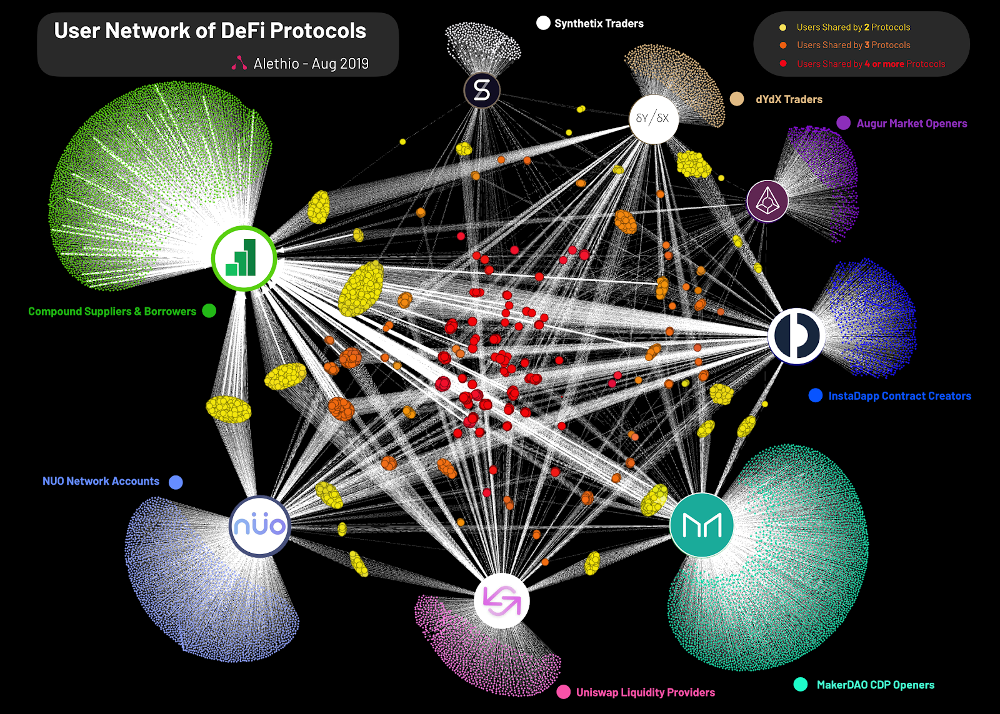

_Note:_ Slides can be autogenerated from this `.md` markdown file using tools like [marp](https://marp.app/), [remarkjs](https://remarkjs.com/), etc.

---

---

<!-- Note: The "marp: true" above is a setting used to render the contents of
this markdown as slides within a text editor - VS Code, to be specific -->

# Ethereum 101

### [@paulcowgill](https://twitter.com/paulcowgill)

---

## Who am I?

### [@paulcowgill](https://twitter.com/paulcowgill)

Freelance full-stack Eth dev.
Building [Tasit](https://tasit.io) project.
I help with organizing the [Chicago Ethereum Meetup](https://www.meetup.com/Chicago-Ethereum-Meetup/).

- [Twitter](https://twitter.com/paulcowgill)
- [GitHub](https://github.com/pcowgill/)
- [Website](https://cowgill.io/)
- [LinkedIn](https://www.linkedin.com/in/pcowgill/)
- [Medium](https://medium.com/@paulcowgill)

---

## This workshop

The markdown file with all of this info we'll be talking about is available at:

[bit.ly/8th-light-ethereum-101](https://bit.ly/8th-light-ethereum-101)

Alternatively, you can get here directly via GitHub:

[github.com/pcowgill/talks](https://github.com/pcowgill/talks)

---

### This workshop/talk will cover the different components of the crypto (web3) tech stack and the current state of the art using the Ethereum blockchain.

---

## Any questions?

Feel free to interrupt me at any time. Freeform / real-time questions work best for me.

Or if you're feeling shy, we can crowdsource questions online. Go to [sli.do](https://www.sli.do/) and enter the event code `#8th-light-ethereum`. I'll stop to check for the most upvoted questions at some point during the workshop.

---

### What to expect

1. **Explore:** [Explore](#explore) some data on the blockchain visually.
1. **Why:** Hear a few arguments for [why](#why) this tech/movement matters.
1. **Dapps:** Try out a couple of particularly useful [dapps](#dapps) (decentralized apps) together.
1. **Gas:** Receive an introduction to the concept of [gas](#gas).
1. **Reading and writing:** Learn about good practices for [reading and writing](#reading-and-writing) data, indexing data, etc.

---

## Explore

---

### Set up a wallet

In order for this exploration to be tangibly meaningful, let's set up wallets first.

While there are lots of choices for wallets, it will be the simplest if you all use [MetaMask](https://metamask.io/) for today.

I'll send you all testnet ETH shortly using the [testnet version](https://testflight.apple.com/join/r9q5stIb) of the [Gnosis Safe](https://safe.gnosis.io/) (a different Ethereum wallet that has cool features like account recovery).

There are lots of other great alternatives that we won't have time to try out today including: [Argent](https://www.argent.xyz), [Coinbase Wallet](https://wallet.coinbase.com/), [Status](https://status.im/), and [Trust](https://trustwallet.com/).

---

### Get test Ether

**`{ Walk around scanning QR codes to send ETH on the Rinkeby testnet }`**

- You can view the transactions we're making on [Etherscan](https://rinkeby.etherscan.io/address/0x1ae4455438316a80E93e1Bb1F6EEbF049eb2A0fB#internaltx)

---

### Explore the blockchain

- **`{ Show a tour of Etherscan }`**

---

##### Other UIs

Here are some alternatives to Etherscan:

- [Blockscout](https://blockscout.com)
- [Alethio](https://aleth.io/)
- [Ganache](https://truffleframework.com/ganache) (although the scope of this product is a bit different)
- [ethplorer](https://ethplorer.io/)
- [scout.cool](https://www.scout.cool/)
- [Elementus](https://elementus.io/)
- [State of the Dapps](https://www.stateofthedapps.com/)
- [Dappradar](https://dappradar.com)

---

### Notifications

Etherscan

[Tenderly](https://tenderly.dev)

[Dagger](https://matic.network/dagger/)

---

##### Big data questions

Visual tools by Alethio:

[ethstats.io](https://ethstats.io/)

[explorer.aleth.io](https://explorer.aleth.io/)

[reports.aleth.io/queries](https://reports.aleth.io/queries)

_Note: Programmatic tools covered later in the "reading data" section of this talk_

---



[Source](https://medium.com/alethio/the-defi-series-monitoring-activities-user-community-growth-f274946d0ac9)

[If image doesn't load](https://raw.githubusercontent.com/pcowgill/talks/master/talks/supplemental/images/UserNetworkOfDeFiProtocols.png)

---

## Why

Why does crypto / blockchain tech matter?

---

### Why Ethereum?

Why cover this through the lens of Ethereum?

**Developer network effect**

---

### Facebook likes with information => micropayments with money

---

### Blockchains are for solving coordination problems

Defaults matter

---

### Blockchains are for transfering anything of value

---

### Why is this important for society?

1. [AI -> tyranny, blockchain -> democracy](https://www.theatlantic.com/magazine/archive/2018/10/yuval-noah-harari-technology-tyranny/568330/): article by Yuval Noah Harari
1. [The Truth Machine](https://smile.amazon.com/Truth-Machine-Blockchain-Future-Everything/dp/1250114578/): book about where all of this is going
1. [Social justice](https://medium.com/swlh/crypto-for-activism-four-models-of-protest-on-the-ethereum-blockchain-61ca5d07ac47): people from Occupy Wall Street making activist blockchain projects
1. [Social good](https://www.meetup.com/Blockchain-for-Social-Good-Chicago/): local meetup in Chicago
1. [Podcast episode](https://www.breaker.audio/a16z/e/35542740): why decentralization matters by a16z
1. [Toy markets](https://blog.ycombinator.com/toy-markets/): YC blog post
1. [Twitter thread](https://twitter.com/naval/status/877467629308395521): a historical perspective on governance by Naval Ravikant

---

## Why is this important as an entrepreneur / developer?

Zero platform risk -> the great unbundling of front end and back end (and of individual front end features). Users get "right to exit" meaning that they can elect to use alternative clients without losing all of their data and the network effect of the platform, and the tech tycoons of the future can't prevent them from doing so.

#### Composability

---

## Dapps

---

### Wallets

The wallets you set up earlier are a prerequisite for using these dapps.

_(Note: Hopefully that won't be the case in the future.)_

---

#### DAOs

**Note: You should be logged into the MetaMask browser extension and load this page on a PC in order for it to show up properly.**

- [Aragon](https://rinkeby.aragon.org/#/) on testnet
- [Moloch](https://molochdao.com/)
- Colony
- DAOStack

**`{ Set up an Aragon DAO for the group }`**

---

#### TCRs

[Humanity DAO](https://www.humanitydao.org/)
_(caveat that this is kind of a DAO and an identity solution too)_

---

#### DeFi

**Exchanges**

[Uniswap](https://uniswap.exchange)

**Lending**

[Dharma](https://dharma.io/)

**Credit**

[Bloom](https://bloom.co/)

---

#### DeFi part deux

**Insurance**

[Nexus Mutual](https://www.nexusmutual.io/)

**Prediction markets**
[Guesser](https://guesser.com/) and [Sight by Gnosis](https://sight.pm/)

---

**`{ Try Uniswap }`**

---

##### Games

`{ Optional: Purchase a digital collectible and exchanging it with other classmates. }`

- [CryptoKitties](https://www.cryptokitties.co/)
- Lots of others

##### VR

[Decentraland](https://decentraland.org/)

---

##### Art

[Clovers](https://clovers.network/)

[SuperRare](https://www.superrare.co/)

[Known Origin](https://knownorigin.io/)

##### Music

[Audius](https://audius.co/)

---

##### Identity

[3Box](https://3box.io/)

[BrightID](https://www.brightid.org/)

---

##### Marketplaces

- [OpenSea](https://opensea.io/)
- [Decentraland Marketplace](https://market.decentraland.org/)
- [Gitcoin](https://gitcoin.co/)
- [0x](https://www.0xproject.com/)

---

##### Internet Infrastructure

[ENS](https://ens.domains/)

---

## Gas

---

### Gas

`{ Talk a bit about how gas is used on Ethereum }`

- [ETH gas station](https://ethgasstation.info/)
- [gastoken](https://gastoken.io/)

---

## Reading and writing

---

### What are we reading from and writing to again?

Here's an example project set up on [studio.ethereum.org](https://studio.ethereum.org/5dcb1bb026b473001233da59?openFile=README.md)

---

The [Truffle](https://truffleframework.com/) framework for developing smart contracts

Or [Buidler (task runner), ethers, Waffle (test runner), and TypeChain (typings for smart contracts)](https://hackernoon.com/the-new-solidity-dev-stack-buidler-ethers-waffle-typescript-706830w0)

---

#### Writing

`ethers`

Signers and providers are different features

Provider might be Infura, Alchemy, Etherscan, your own local node

Has a CLI

---

#### Writing in a test env first

##### Deps

```typescript
import { ethers } from "@nomiclabs/buidler";
import chai from "chai";
import { deployContract, getWallets, solidity } from "ethereum-waffle";

import CounterAbi from "../build/Counter.json";
import { Counter } from "../types/Counter";

chai.use(solidity);
const { expect } = chai;
```

---

##### Setup

```typescript
describe("Counter", () => {
  const provider = ethers.provider;
  const [wallet] = getWallets(provider);

  // use contract type
  let counter: Counter;

  beforeEach(async () => {
    // cast as type
    counter = await deployContract(wallet, CounterAbi) as Counter;

    // function name is available as part of types
    const initialCount = await counter.getCount();

    expect(initialCount).to.eq(0);
    expect(counter.address).to.properAddress;
  });
```

---

##### Tests

```typescript

  it("should count up", async () => {
    await counter.countUp();
    let count = await counter.getCount();
    expect(count).to.eq(1);

    await counter.countUp();
    count = await counter.getCount();
    expect(count).to.eq(2);
  });

  it("should count down", async () => {
    await counter.countDown();
    const count = await counter.getCount();
    expect(count).to.eq(0);
  });
});
```

---

`{ Mention potential CLI usage with ENS }`

---

#### Writing on mainnet from a front end

---

#### Configuring app

```jsx
import { Web3ReactProvider } from "@web3-react/core";
import { ethers } from "ethers";

function getLibrary(provider) {
  const library = new ethers.providers.Web3Provider(provider);
  library.pollingInterval = 10000;
  return library;
}

ReactDOM.render(
  <Web3ReactProvider getLibrary={getLibrary}>
    <App />
  </Web3ReactProvider>,
  document.getElementById("root")
);
```

---

#### Wiring up connection

```typescript
import { InjectedConnector } from "@web3-react/injected-connector";

export const injected = new InjectedConnector({
  supportedChainIds: [1]
});
```

---

#### Connect on click

```jsx
import { injected } from "../connectors";
import { useState, useEffect } from "react";
import { useWeb3React } from "@web3-react/core";

export default function WalletComponent() {
  const { activate, active } = useWeb3React();

  const [tried, setTried] = useState(false);
  const tryActivation = async connector => {
    try {
      await activate(connector, undefined, true);
    } catch (e) {
      setTried(true);
    }
  };
  return (
    <OptionGrid>
      <Option
        onClick={() => {
          tryActivation(injected);
        }}
        active={injected === connector}
        color="#E8831D"
        header="MetaMask"
        icon={require("../../assets/images/metamask.png")}
      />
    </OptionGrid>
  );
}
```

---

##### Reading programmatically

- [Graph protocol](https://thegraph.com)

- [Google's BigQuery dataset for Ethereum](https://cloud.google.com/blog/products/data-analytics/ethereum-bigquery-public-dataset-smart-contract-analytics)

- [VulcanizeDB](https://github.com/vulcanize/VulcanizeDB)

---

### Tools for ELK / elastic stack

There are some tools out there for this as well

- Elasticsearch: search and analytics
- Logstash: server‑side data processing pipeline that ingests data from multiple sources simultaneously, transforms it, and then sends it to a "stash" like Elasticsearch
- Kibana: lets users visualize data with charts and graphs in Elasticsearch

---

Thanks! Any questions?

[@paulcowgill](https://twitter.com/paulcowgill) on Twitter
