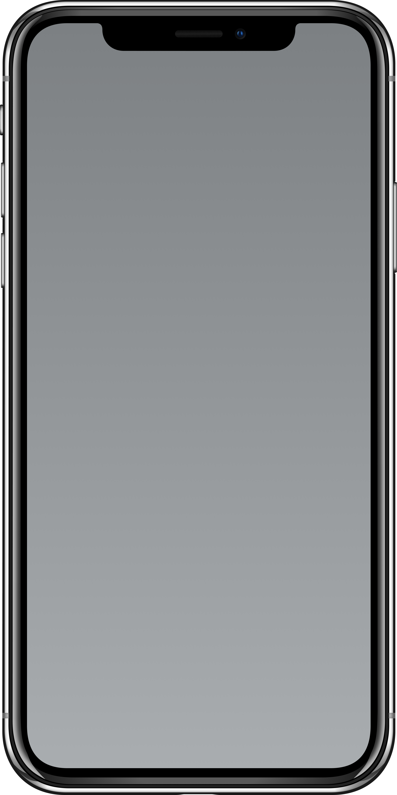
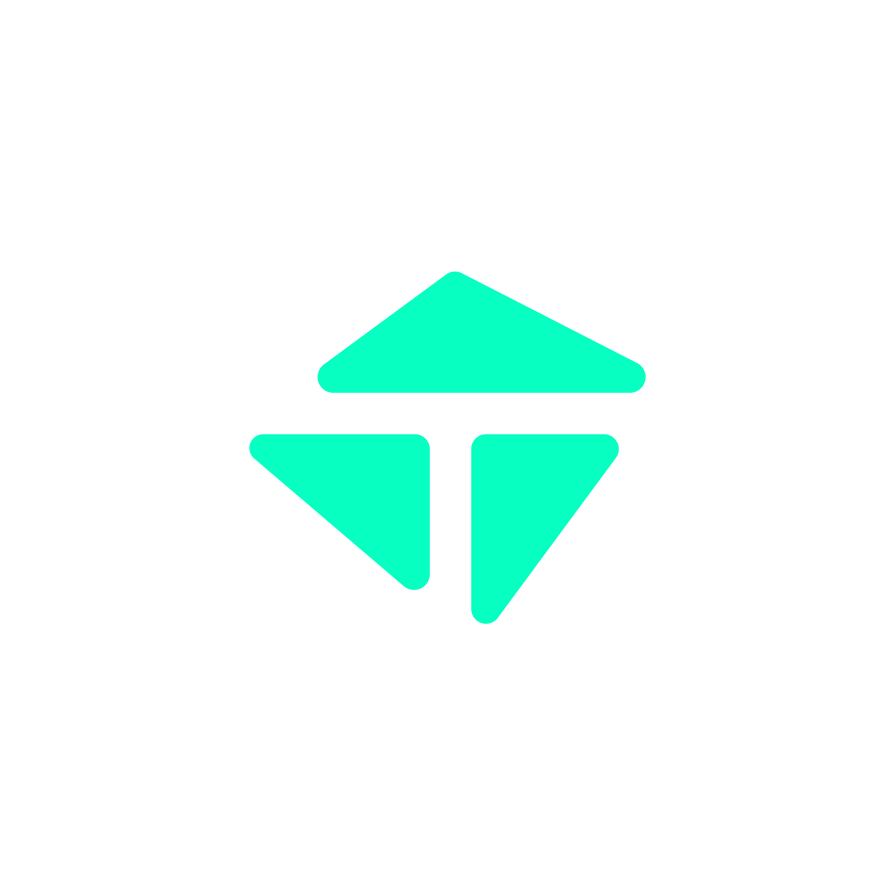
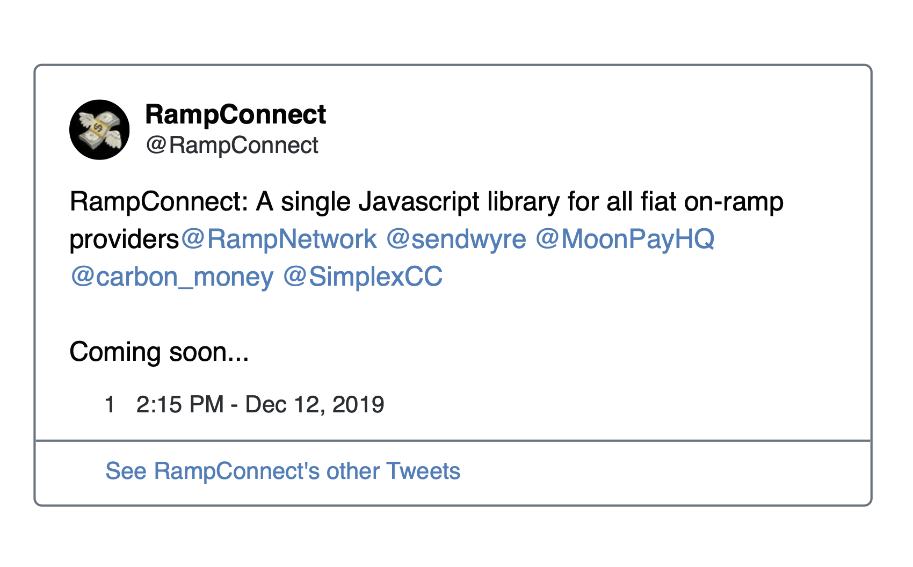
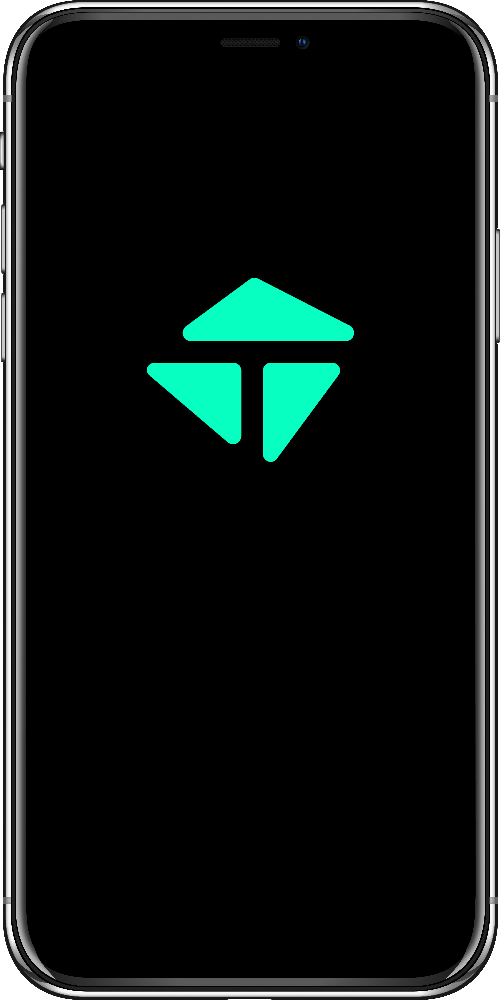
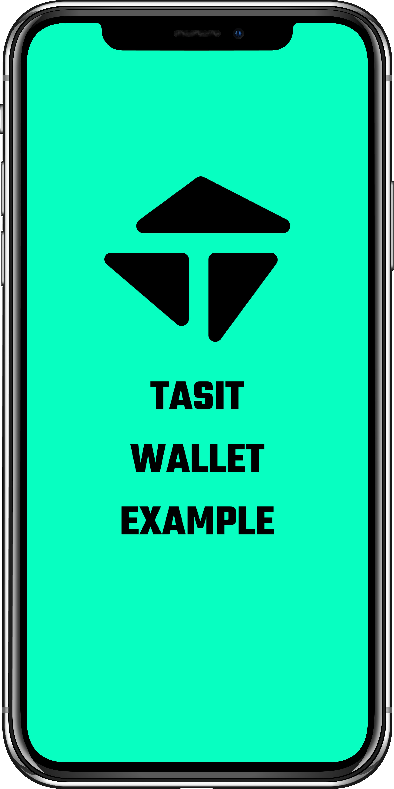
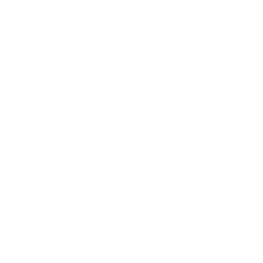
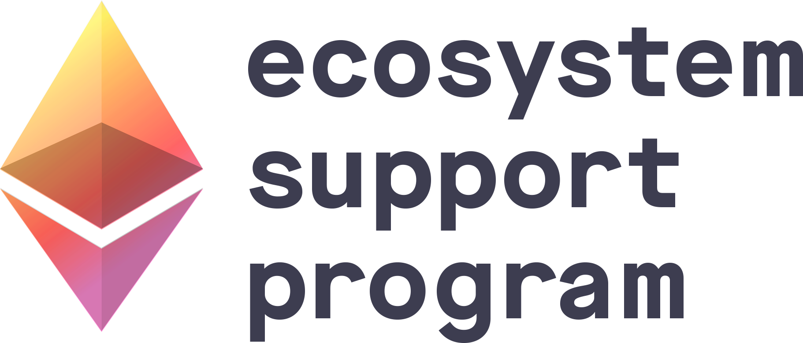
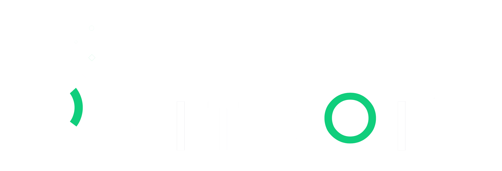

# Native mobile Ethereum dapps

## Paul Cowgill 📱 Tasit

---

# Outline

### **why**

### **what about censorship?**

### **how**

---

# who am I?

### [@paulcowgill](https://twitter.com/paulcowgill)


---

# why

---

[.column]

## phones

<br />



[.column]

## laptops

<br />


^ Young people worldwide do most things on the internet from their phones. And yet we're building web-based dapps optimized for use on laptops.

---

# native vs. web

Native mobile apps are the current winner in web 2.
<br />

A slightly larger swath of **disengaged users** might try a mobile web app first.

But the “sticky”, **power users** prefer native mobile apps.

---

# when to use native mobile?

- young and/or global user base
- high frequency or real time
- low(ish) stakes—although this is changing
- biometric auth
- convenient, reliable, local data persistence
- uses camera or GPS

---

# what about censorship?

---

# make it impossible

<br />
<br />

Use **contract-based accounts** (or **WalletConnect**)

^ This means that there’s no loss of funds or ability to use the contracts with the same “account” even in the case of censorship.

---

# scenarios with React Native

**Apple takedown?**
Works on Android

**Google takedown?**
Works on iOS

**Gone from both platforms?**
`react-native-web` or sharing code with a React codebase

---

> Bigtechco policies change along with the zeitgeist.

---

# how

---

# building native mobile dapps

<br />
<br />

Simple UX with no decentralization tradeoff

---

> If your project disappears one day, the user should be very disappointed but able to use the contracts in another way.

---

> Let the user arbitrarily upgrade the security with hardware wallets, dedicated "wallets", etc., but bury those options in an advanced menu.

---

# what is needed to do this well?

[.column]

### **onboarding**

- in-dapp fiat onramps
- in-dapp wallets (burner and contract-based)

[.column]

### **ongoing UX**

- ENS
- The Graph
- optimistic UI
- meta-transactions

[.column]

### **mobile stuff**

- deep linking
- biometric auth
- push notifications

---



---

# onboarding

---

# in-dapp burner wallets

<br/>

> To attract the next wave of Ethereum users...
> <br/>

> ...we should assume that users don’t have a wallet yet.

^ Let’s set them up with their first "wallet” in the app they want to use instead of kicking them elsewhere to a separate app to set one up before they can get started.

---

# a single, fluid UX

```js
import { Account } from "tasit-sdk";
const burnerWallet = await Account.create();
const { address } = burnerWallet;
console.log(address); // '0x...'
// ...
```

---

# another new account?

<br />

For new users, they don't have a preexisting account anyway, and this could evolve into their main account.
<br />

A new account is better for OPSEC and accounting reasons.

---

# contract-based accounts pt. 1

```ts
const { address: burnerWalletAddress } = burnerWallet;
const username = "paul";
const contractKind = "gnosis-safe"; // | "argent" | "abridged" | "authereum" | ...

const create2ContractBasedAccount = await Account.upgrade({
  account: burnerWalletAddress,
  username: username,
  contractKind: contractKind
});
```

---

# contract-based accounts pt. 2

```ts
console.log(create2ContractBasedAccount.address); // Send it an ERC20 token!

const contractBasedAccount = await create2ContractBasedAccount.deploy();

console.log(contractBasedAccount.ensName); // paul.{NAMEOFTHISDAPP}.eth
```

---

# 100 accounts per user

_(Some upgraded into contracts, some not)_
<br />

investment, savings, gaming, work, hobbies, side projects, social, ...

---

> Should we wire this up with a "parent" contract-based account?

---

[.header: #333333]

[.background-color: #ffffff]

# in-dapp fiat onramps



---

# ongoing UX

---

# optimistic UI pt. 1

```js
import { Contract } from "tasit-sdk";
const { NFT } = Contract;

const contractAddress = "0x0E86...333";
const contract = new NFT(contractAddress);

// No await???
const action = contract.safeTransferFrom(/*...*/);
```

---

# optimistic UI pt. 2

```js
action.on("error", errorListener);
action.on("oneConfirmation", goodSignListener);
action.on("enoughConfirmations", successListener);
action.send(); // broadcast

// Do optimistic UI updates immediately, while making sure
// to update the UI again when there are enough
// confirmations for your use case
// ...
```

---

## 💭

### Wait, but I like await.

---

# the graph

```js
const action = contract.safeTransferfrom(/*...*/);
action.on("error", errorListener);
action.on("presentInTheGraph", successListener);
action.send(); // broadcast
// ...
```

_(And of course more standard things like querying for a lot of indexed events)_

---

# ENS

[.column]

### Sending

**somebodyelse.eth**

_(ethers.js under the hood)_

[.column]

### Receiving

**paul.uniswap.eth**
**paul.gitcoin.eth**
**paul.tasit.eth**

---

# meta-transactions

```js
const action = contract.myFavoriteMethod(/*...*/);
action.on("error", errorListener);
action.on("enoughConfirmations", successListener);
action.sendForFree(); // meta-tx broadcast

// ...
```

---

# mobile-specific features

---

# deep linking

#  ⇄ 

---

# biometric auth & push notifications

<br />
<br />

_{coming soon}_

---

## boiling the ocean?

  

^ We use a lot of great SDKs under the hood

---

> Don't use too many browser APIs in your js SDK.

---

# scaling and privacy

---

# scaling and privacy

### L2

_state channels, (optimistic | zk) rollup_

### Eth2

### Privacy

---

# wrapping up

---

# dapps are useful!

<br />

Dapps **already** deliver significant value and “a-ha” moments to **crypto-native** “innovators”.
<br />

These apps would be useful for mainstream people too if packaged correctly.

---

# UX is the problem

<br />
<br />

great **web 2 product teams** can fix this
if they're given the right tools.

---

# where to go from here

<br />

We're actively doing **user interviews** and **developer interviews** to shape which features to prioritize.
<br />

_[@paulcowgill](https://twitter.com/paulcowgill)_

---

# thanks







---

[.column]

### 🤐 **Website**

[tasit.io](https://tasit.io)

### 💻 **GitHub**

[github.com/tasitlabs](https://github.com/tasitlabs)

### 📄 **Docs**

[docs.tasit.io](https://docs.tasit.io)

[.column]

### 🐦 **Twitter**

[@TasitProject](https://twitter.com/TasitProject)

### 💬 **Discord**

[bit.ly/tasit-discord](https://bit.ly/tasit-discord)

### 💬 **Telegram**

[t.me/tasitproject](t.me/tasitproject)

[.column]

### 📝 **Medium**

[medium.com/tasit](https://medium.com/tasit)

### 💡 **Features**

[feedback.tasit.io](https://feedback.tasit.io/feature-requests)
